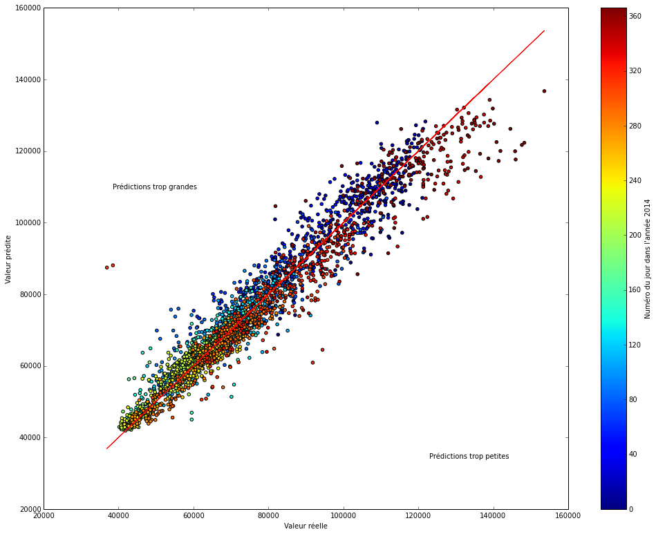
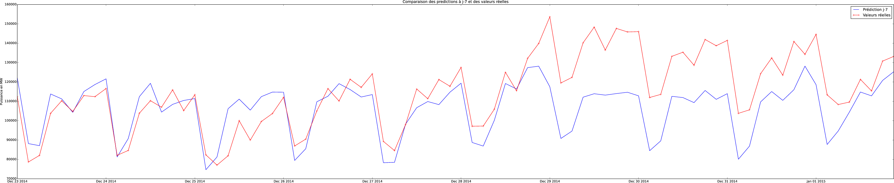
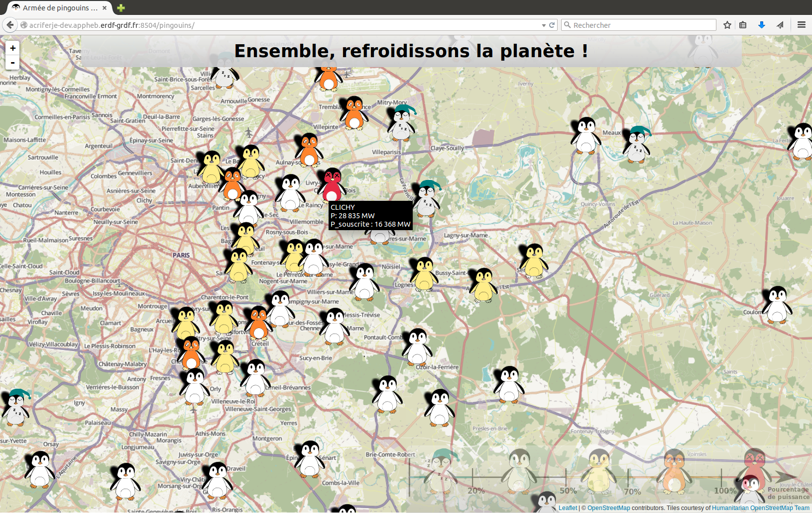

# Introduction

## Contexte

- ERDF, distributeur d'électricité et leader
- Agence de conduite régionale (ACR)
    - intervention en temps réel
    - surveillance du réseau

--------------------

--------------------

--------------------

## Missions

- Ariane
- **epythie**
    - analyse de données
    - réalisation
- DRIM'IN
- **Hackathon**
- **pingouins**

# Prévision de la consommation électrique

## Données disponibles

- Données météofrance (sur FTP)
- Relevés télémesures (sur BDD EtaReso)

## Développement d'un système d'unification des données

----------------------

## Analyse des données

--------------------

-------------------

--------------------

--------------------

## Conclusion

Le modèle est bon, mais ne prend pas en compte **la structure du réseau**.

Les prédictions ne sont pas utilisables hors du schéma normal.

# Autres missions

## Hackathon

* Deux jours pour un projet
* Expérience humaine et technique
* Nouvelles technologies
    *  AngularJS
    *  APIs en PHP

--------------------

## pingouins

* Visualisation innovante
* Utilisation de la bibliothèque JS **leaflet**
* Design des pingoins par un conducteur réseau

--------------------

# Conclusion

## Ce que ce stage m'a apporté

* technique
    * AngularJS
    * Analyse de données
* Mais **surtout**
  * connaissance de l'entreprise
  * gestion des relations humaines
  * organisation du travail

## Futur

*  Les pingoins sont toujours utilisés
*  L'outil de prévision va peut-être être repris par le national
*  J'envisage de travailler dans le même domaine

------------------

**Merci** de votre attention. *Des questions ?*
