# Introduction

## Remerciements
Je tiens à remercier mon maître de stage, Sylvain Jouhanneau,
pour son suivi régulier de mon stage, les projets intéressants qu’il m’a proposés,
et les personnes qu’il m’a permis de rencontrer.

Je remercie également Yann Le Hervé, mon collègue programmeur au sein de l’ACR,
pour son aide quotidienne, ses réponses toujours rapides et précises à toutes
mes questions sur le réseau électrique et la structure des bases de données dont
j’avais besoin.

Enfin, je remercie toute l’équipe de l’ACR, et en particuliers les préparateurs
pour leur accueil chaleureux et leur sympathie.

## Présentation de l’entreprise
### EDF - ERDF
Pour comprendre le contexte de mon stage, et les enjeux des missions que j’ai
effectuées, il faut comprendre le rôle d’ERDF dans le réseau électrique français.

À sa création après guerre, EDF (Électricité De France) avait un monopole sur
la production, le transport et la distribution d’électricité. L'ouverture
progressive du marché de l’électricité entre 1999 et 2008 pousse EDF a créer
des filiales qui ont chacune un domaine d’activité restreint et bien défini.

C'est ainsi qu'en 2000 est créé **RTE** (pour Réseau de Transport d'Électricité),
filiale d’EDF chargée du transport de l’électricité. RTE se charge de transporter
l'électricité à très haute tension depuis son lieu de production sur de longues
distances, jusqu'à l'entrée en zone urbaine.

En 2008 est créée la filiale **ERDF**, chargée de gérer de réseau de **distribution**.
ERDF s'occuppe de la maintenance et de l'exploitation de toute la partie du réseau
basse et moyenne tension, mais elle n'en est pas propriétaire. Ce sont les collectivités
locales qui possèdent les lignes, et sont libres de choisir une entreprise de
distribution pour les gérer. Cependant, ERDF est dans une situation de quasi-monopole,
et 95% des lignes sont sous sa responsabilité. C'est notemment ERDF qui intervient
sur les lignes lorsqu'un incident survient, et qui modifie en temps réel la structure
du réseau (à l'aide d'interrupteurs, dont certains sont télécommandés) pour l'adapter
à la demande en énergie, aux travaux en cours sur le réseau, et aux pannes.

Le 31 mai 2016, après la fin de mon stage, l'entreprise a changé de nom, et s'appelle
désormais **Enedis**.  

## Glossaire
#### ACR
Agence de Conduite Régionale, service d’ERDF chargé de surveiller en temps réel
l'état du réseau électrique, et de s’assurer que les clients soient alimentés
en permanence, même lorsqu'un incident survient. Pour cela, elle peut visualiser
la totalité du réseau de la région dont elle a la charge, peut actionner certains
interrupteurs à distance, et est en contact téléphonique avec les agents du terrain
pour manœuvrer les parties du réseau qui ne sont pas télécommandées.

Il y a environ une ACR par région, avec l'exception notable de l'Île de France,
divisée en trois: *Île de France Ouest*, *Paris*, et *Île de France Est* où
j'ai effectué mon stage.  

### Les agents
#### Conducteur
Agent de l’ACR qui *conduit* le réseau. Il effectue à l'aide d'un logiciel
appelé **outil de conduite** les manœuvres nécessaires pour
rétablir le courant chez les clients, ou au contraire pour mettre une portion hors
tension avant des travaux.

#### Préparateur
Agent de l’ACR chargé de la préparation de chantiers sur le réseau. Il prépare la
liste de manœuvres que devra effectuer le conducteur.

### Types de courant
#### BT
Basse tension, entre 50 et 1000 volts. Il est sous la responsabilité d’ERDF,
mais n’est pas piloté par l'ACR.

#### HTA
Haute tension de *type A*, entre 1 et 50 kilovolts. C'est à cette tension
qu’opère le réseau électrique dont l'ACR est en charge.

#### HTB
Haute tension de *type B*, au delà de 50 kilovolts. C'est à cette tension qu’opère
le réseau électrique piloté par le **RTE**.

### Les éléments du réseau
#### Poste source
Poste de transformation de la HTB vers la HTA. Un poste source contient plusieurs
ouvrages différents. Il est installé sur un terrain de plusieurs milliers de mètres
carrés. L'intensité du courant qui transite par un poste source varie en permanence
en fonction de la demande en électricité, pour une puissance totale de plusieurs
dizaines de mégawatts, alimentant des milliers de clients.
L’ACR d'Île de France Est contrôle 83 postes sources, sur quatre départements.

#### Télémesure, ou TM
Outil mesurant en temps réel une puissance. Cette donnée est affichée en temps
réel dans l’outil de conduite des conducteurs, et est archivée avec un pas de
dix minutes dans une base de données, elle aussi accessible en lecture depuis
l’ACR.

#### Départ
Une ligne électrique sortant d’un poste source. Chaque poste source contient de quelques
départs à quelques dizaines de départs. Les départs peuvent le plus souvent être
*repris* les uns par les autres, c'est-à-dire qu'une portion de réseau faisant
partie d'un départ peut être alimentée par un autre départ lorsqu'un incident
survient. Pour chaque départ, on dispose d’une télémesure.

#### Poste HTA-BT
Poste de transformation de la HTA vers la basse tension. Ils sont beaucoup moins
imposants que les postes sources (quelques mètres carrés, quelques centaines de
kilowatts), mais beaucoup plus nombreux (quelques centaines de milliers en Île-de-France Est).
On ne dispose pas aujourd’hui de télémesures indiquant en temps réel la puissance
de ces postes.

#### Autres
Le réseau contient des dizaines de types d’ouvrages différents, je n’ai décrit ici
que ce qui vous sera utile pour la poursuite de la lecture de ce rapport...

## Organisation, stockage, et traitement des données chez ERDF
Le but de cette partie n’est pas de faire une liste exhaustive des outils informatiques
et bases de données d’ERDF, dont je ne maîtrise qu’une infime partie, mais d’expliquer
comment est organisée la partie du système d’informations qui concerne l’ACR, et
avec laquelle j’ai été amené à interagir. Cela évitera d’avoir à redéfinir le
rôle de chaque outil chaque fois qu’il sera mentionné.


### Les données

On parle ici des données récoltées sur le réseau électrique en temps réel
(comme les valeurs des télémesures, les incidents, les changements de structure),
mais aussi des données qui se mettent à jour moins souvent comme la liste des clients, la liste
des ACR de France, le schéma normal du réseau, le nom des postes sources et de leurs départs.

### Système d'accès aux données


#### Où sont-elles?
Les données reçues des postes sources, le schéma du réseau, et les données de configuration saisies
par les configurateurs sont stockées et traitées sur le **SYSTÈME-XXX**.

Le *SYSTÈME-XXX* exporte certaines de ses données régulièrement et automatiquement
sur la base de données SQL **DB-YYY**, et c'est cette base qui est utilisée par les
applications développées à l'ACR. Par exemple, les données de toutes les télémesures du réseau
sont enregistrées, et sauvegardées avec un intervalle de 10 minutes sur *DB-YYY*.

Toutes les données ne sont pas dans *DB-YYY*, et la structure de la base de données
n'est pas documentée, mais un graphe complet des tables et de leurs relations
a été généré.

On peut récupérer certaines données concernant le schéma du
réseau dans le fichier **fichier-ZZZ**.

D'autres données encore ne sont pas accessibles du tout en dehors des postes des conducteurs.

#### Comment y accède-t-on?
Les outils développés par le *GTAR* (entité informatique nationale d’ERDF)
ont accès à toutes les données du *SYSTÈME-XXX*.
Ces données sont cohérentes entre elles et les personnes qui développent ces outils
connaissent la structure des données dans le SYSTÈME-XXX.

Les outils développés dans les ACR ou par des prestataires, par contre, ont
également besoin des données, mais ne peuvent pas les utiliser directement.
Ils utilisent donc les extractions des données du SYSTÈME-XXX, comme la base
DB-YYY ou le fichier fichier-ZZZ.

## Sujet du stage
J’ai été recruté au sein de l’ACR d'Île-de-France Est en tant que stagiaire
*data-scientist* (spécialiste de l’extraction, du traitement, et de la visualisation
de données), dans le but de développer un algorithme de prédiction des valeurs
de puissance des postes source.

J'ai pour cela utilisé un modèle
implémenté dans le langage Python, et dont les résultats sont visualisables dans
une interface web.

Mais mon stage m’a aussi poussé à découvrir de nombreuses autres problématiques
liées à l'informatique chez ERDF, et à répondre à certaines d’entre elles.

Je présente donc dans ce rapport toutes les missions les plus importantes sur
lesquelles j’ai travaillé, et les évènements auxquels j'ai participé,
même si beaucoup ne sont pas en rapport direct avec mon sujet de stage initial.

# Première mission: Ariane, site de présentation des évolutions de l’outil de conduite du réseau

### Contexte
En arrivant chez ERDF, la première mission que l'on m'a confiée est la réalisation
du site web de présentation de la dernière mise à jour de l'**outil de conduite**.

Peu de temps avant mon arrivée, une mise à jour importante de l'outil qu'utilisent
les conducteurs pour gérer le réseau avait été effectuée. Cette mise à jour introduisait
de nouvelles fonctionnalités, de nouveaux éléments d'interface graphique, et les
conducteurs devaient être formés à l'utilisation des nouvelles fonctionnalités de
l'outil.

Pour cela, le directeur de l'ACR d'Île de France Est, mon maître de stage, avait
proposé à l'équipe de développement (équipe nationale) de réaliser un site web, qui
serait disponible à toutes les ACR de France, à travers l'intranet d'ERDF. Il m'a
confié cette mission à mon arrivée, avant que je commence à travailler sur le sujet
principal de mon stage.

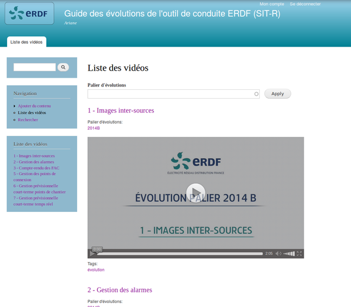

### Cahier des charges
Aucun cahier des charges formel n'avait été réalisé, mais le site devait:

##### Présenter du contenu
Le site présente un article par fonctionnalité à expliquer,
accompagné éventuellement d'une vidéo réalisée par l'équipe de développement.

##### Avoir un outil de recherche
L'interface permet la recherche par mot clef, afin que les conducteurs
trouvent rapidement l'aide dont ils ont besoin.

##### Permettre aux développeurs d'ajouter du contenu
Les développeurs peuvent ajouter, à l'aide d'une interface graphique,
de nouvelles vidéos, et de nouveaux articles pour les fonctionnalités futures
de l'outil.

##### Assurer la plus grande confidentialité possible
L'outil de conduite n'est accessible
qu'aux conducteurs, et l'on ne veut pas que des personnes mal intentionnées puissent
se former d'elles-mêmes à l'utilisation de l'outil de conduite pour en faire
éventuellement par la suite une utilisation malveillante.

### Réalisation
En accord avec l'autre développeur de l'ACR, nous avons décidé d'utiliser le
système de gestion de contenu (*CMS*) **Drupal**.

Nous avons ajouté un module d'affichage de vidéo et converti les vidéos, puis
créé un *type de contenu* Drupal pour
les pages d'explication de fonctionnalités, créé un thème à partir de celui proposé
par défaut, et enfin créé les articles et ajouté les mots-clefs correspondant.

L'accès même en simple visualisation au contenu nécessite un compte
utilisateur, et un *groupe d'utilisateur* est créé
pour les développeurs du GTAR, afin qu'ils puissent ajouter de nouvelles pages de contenu.
Le site est hébergé par ERDF lui-même grâce à son service *service-AAA*, et accessible uniquement à travers l'intranet national ERDF.

Après une semaine, le site correspondait à ce qui était attendu. Nous avons
donc organisé une réunion de livraison au **GTAR**
(pôle national de développement de l'outil de conduite), où nous avons expliqué son fonctionnement. Les développeurs
étaient satisfaits, et cela a été l'occasion de découvrir ce pôle d'ERDF, ses missions,
son organisation et ses méthodes de travail.

# epythie, prédiction de courbes de charge


Après l'épreuve d'initiation qu'a été la création du site web *Ariane*, j'ai pu
commencer à me concentrer sur l'objet principal de mon stage, la création de
l'outil de prédiction de charge des postes sources.

## Objectif
L'objectif était de créer un dispositif qui permettrait de prévoir la charge
(l'intensité à fournir) approximative d'un poste source à une date
donnée.

Ces données prédictives peuvent ensuite être utiles dans plusieurs cas, notemment:

##### Souscription auprès du RTE
ERDF doit régulièrement *souscrire* auprès de RTE à une certaine puissance pour
chacun de ses postes sources. Cela permet à RTE d'organiser efficacement
le transport de l'électricité, en connaissant à l'avance les besoins
de distribution en électricité.
Mais cela demande à ERDF de spécifier cette consommation future.
Si ERDF souscrit à une puissance trop faible, et qu'un poste source utilise
finalement plus que ce qui avait été spécifié, alors ERDF paiera beaucoup plus
cher tous les mégawatts utilisés qui n'avaient pas été souscrits.
Si, au contraire, ERDF souscrit à une puissance plus élevée que ce qui sera
réellement utilisé, alors il aura payé pour rien. Avoir un outil de prévision
permet donc aux spécialistes chargés de la souscription d'avoir des données
supplémentaires permettant de rationnaliser cette dépense.

##### Optimisation de la maintenance
Des travaux de maintenance doivent régulièrement être effectués au sein
des postes sources, pour remplacer des éléments anciens ou défectueux.
Lors de ces opérations, il faut mettre hors tension le départ concerné
par la maintenance.

##### Gestion des crises
On appelle une période de crise une durée de quelques jours où un nombre d'incidents
anormalement grand survient. Une crise peut être dûe à plusieurs facteurs, comme
une tempête, ou une vague de chaleur. Lors de mon stage, nous avons fait face à
une crise dûe à la canicule d'août 2015.
Lors de tels évènements, connaître à l'avance la demande en énergie peut être très
profitable, pour savoir où intervenir en priorité.

À noter: ERDF dispose déjà d'un modèle de prévision des incidents. La recherche
et le modèle mathématique ont été faits par un ancien polytechnicien qui travaille
pour ERDF au niveau national, que j'ai eu l'occasion de rencontrer. L'implémentation
concrète en PHP a été développée par mon collègue Yann et n'est pour l'instant
déployée que dans les ACR d'Île De France (Est, Ouest et Paris).

## Recherche de données
Bien sûr, pour espérer pouvoir prévoir la consommation des postes sources en
temps réel, il faut avant tout pouvoir examiner les données du passé, trouver
quelles données sont pertinentes, et comment corréler des facteurs
extérieurs avec la donnée que l'on cherche à prédire.

En l'occurrence, le seul facteur extérieur auquel je me suis intéressé est la météo,
et en particulier la température extérieure. Ce pour deux raisons:

 * les courbes de charges (puissance délivrée en fonction du temps) sont très **fortement
auto-corrélées**. Elles sont presque périodiques; la consommation à l'instant
*t* dépend beaucoup de *t* et de la consommation à l'instant *t-1*.
 * par expérience des employés de l'ACR, on sait que la consommation dépend de manière
visible de la météo. Elle **augmente légèrement** mais visiblement **lorsqu'il fait
froid** ou que le temps est mauvais.

#### Données des télémesures
Les données concernant les valeurs de puissances distribuées sont, comme
expliqué plus haut, mesurées par des télémesures, récupérées par le **SYSTÈME-XXX**, et
sauvegardées à intervalle régulier sur la base de données **DB-YYY**, à laquelle
j'ai accès en lecture.

La structure de la base n'est pas documentée, mais mon collègue Yann a l'habitude
de travailler avec, et a déjà eu à faire des applications qui accédaient aux
télémesures, il m'indique rapidement où chercher. Et un premier problème apparaît:
la structure de la table dans laquelle sont sauvegardées ces données.

Comme on le voit, les valeurs des télémesures pour une même journée sont "en ligne"
et non "en colonne", ce qui complexifie notablement les requêtes SQL et les scripts
de traitement des données si l'on considère les valeurs de télémesure comme des séries
temporelles. Les scripts doivent générer le texte de la requête SQL pour qu'ils
contiennent les noms des *24 \* 6 = 144* colonnes, et ensuite reformater
le résultat des différentes lignes de retour de la requête pour en faire une simple liste.

Un second problème (certainement lié au format de la table aussi), est que les
requêtes sont parfois très lentes. La base de données contient beaucoup de données,
et est utilisée presque en permanence par les autres applications de l'APR. Il n'est
ainsi pas vraiment envisageable de se servir de cette table directement lorsque
l'on a besoin de grosses quantités de données pour générer les prévisions, ni
même dans un premier temps pour étudier les données.

#### Données météorologiques
ERDF a souscrit à un abonnement auprès de météofrance, qui lui fournit régulièrement
(tous les jours, deux fois par jour) des données météorologiques concernant la température constatée des jours passés ainsi que des prévisions pour les 12 jours à venir.

Ces données ne sont pas enregistrées dans une base de données, mais sur un **serveur
FTP** protégé par mot de passe, accessible depuis l'intranet ERDF. On m'a fourni
le mot de passe, et le court fichier texte de documentation du format des fichiers
disponibles sur le serveur.

Les fichiers contiennent pour chaque jour des températures précises au dixième
de degré près, relevées toutes les trois heures de minuit à 21 heures compris,
ainsi que la minimale et la maximale de la journée.
On n'a les données que d'une station météo, située en Île de France.

La connexion au serveur FTP et l'accès aux fichiers peuvent bien sûr être
scriptés, mais encore une fois, l'accès n'est pas assez rapide pour envisager une
utilisation *en temps réel*.

### Normalisation des données
Pour toutes les raisons citées précédemment, j'ai décidé de créer ma propre base
de données pour stocker les valeurs de puissance des télémesures et
de température de Météofrance.

Ma base de données a la structure suivante [^sql] :

[^sql]: Source du dump SQL, reformatée pour être plus lisible.

```SQL
CREATE TABLE `meteo` (
  `date` datetime NOT NULL
    COMMENT 'Date et heure du relevé',

  `temperature` float NOT NULL
    COMMENT 'Valeur de température en degré celsius'

) ENGINE=InnoDB DEFAULT CHARSET=utf8 COLLATE=utf8_bin;

CREATE TABLE `telemesures` (
  `libelle` varchar(255) COLLATE utf8_bin NOT NULL
      COMMENT 'Libellé de la télémesure',

  `date` datetime NOT NULL
      COMMENT 'Date et heure de la télémesure',

  `heure_avance_prevision` int(11) NOT NULL
    COMMENT 'Nombre d''heures à l''avance pour lesquels la prévision a été faite.
    0 si ce n''est pas une prévision mais une valeur effective.',

  `valeur` float NOT NULL
      COMMENT 'Valeur de la télémesure. L''unité dépend de la télémesure',

  PRIMARY KEY (`libelle`,`date`,`heure_avance_prevision`)
) ENGINE=InnoDB DEFAULT CHARSET=utf8 COLLATE=utf8_bin
  COMMENT='Valeurs des télémesures, importées depuis la table TABLE_TTT d''DB-YYY';
```

Comme on le voit, la table telemesures sert non seulement à stocker les valeurs
extraites de DB-YYY, mais aussi les valeurs prédites par mon modèle.
Cela rend très facile l'utilisation "récursive" du modèle pour avoir des prédictions
sur de plus longues durées, par exemple. Le modèle peut prendre en entrée indifféremment
des valeurs effectivement mesurées et des valeurs qui ont elles-mêmes été prédites.

J'ai écrit deux scripts python pour l'import des données respectivement de DB-YYY
et du serveur FTP, et créé une petite bibliothèque python d'accès transparent aux données:
elle permet d'aller chercher les données dans la base, les y importer si elles n'y
sont pas encore, et les retourner sous forme de [dataframe pandas](http://pandas.pydata.org/).

## Analyse des données
Une fois les données importées et accessible sous un format facile d'accès,
j'ai pu commencer le travail d'analyse des données. Je me suis pour cela aidé
d'[ipython](https://ipython.org/),
[pandas](http://pandas.pydata.org),
[numpy](http://www.numpy.org/),
[scipy](http://www.scipy.org/getting-started.html),
[scikit-learn](http://scikit-learn.org/),
[matplotlib](http://matplotlib.org/).

J'ai tout d'abord importé les données d'un poste source, sur toute l'année 2014,
pris toutes les tois heures, afin d'avoir assez de données pour pouvoir commencer
une analyse, et assez peu pour qu'elles tiennent en mémoire et que les calculs soient rapide.

### Évolution de la puissance fournie au cours de l'année

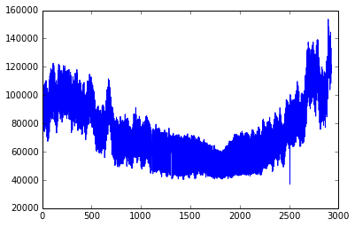
**Puissance fournie en fonction du temps**. L'abscisse est l'index du point dans la liste de données, avec un point toutes les 3 heures. On voit la baisse de consommation en été et la différence nuit/jour.

### Évolution au cours de la journée

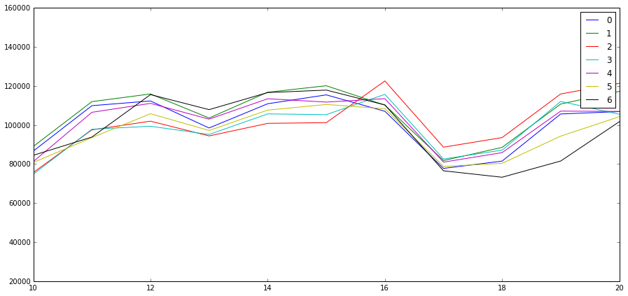
J'ai analysé l'évolution de la **puissance en fonction du jour de la semaine**. Chaque courbe correspond à un jour de la semaine, numéroté de 0 à 6. On voit que tous les jours une courbe de charge assez similaire, et on remarque que le dimanche est légèrement décalé: il monte plus tard le matin, certainement parce que les gens se lèvent plus tard.

### Évolution de la puissance fournie au fonction de la température extérieure

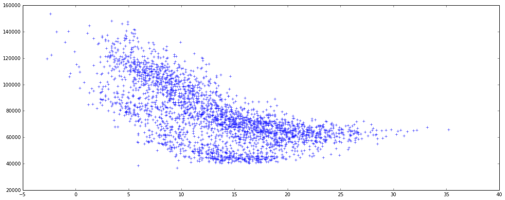
**Puissance fournie en fonction de la température extérieure** en degrés. On voit deux groupes de points correspondants aux valeurs du jour (plus hautes) et de la nuit (plus basses). On voit qu'en dessous de 15 degrés, la consommation est à peu près inversement proportionnelle à la température. Au dessus, elle est environ proportionnelle, mais avec un coefficient de proportionnalité (nombre de Mégawatts générés par degré supplémentaire) beaucoup plus faible.

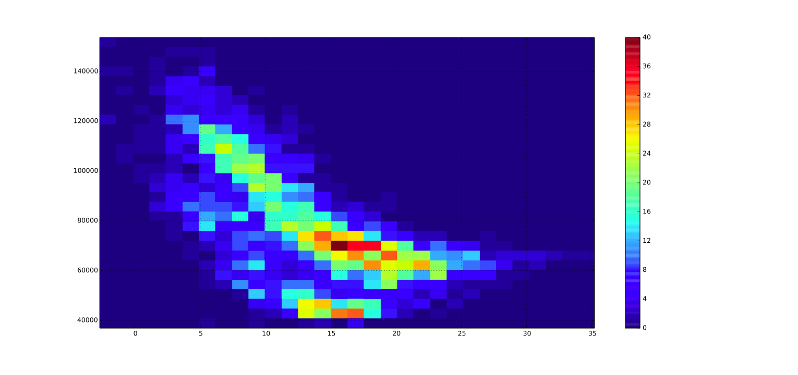
**Puissance en fonction de la température** extérieure sous forme d'histogramme

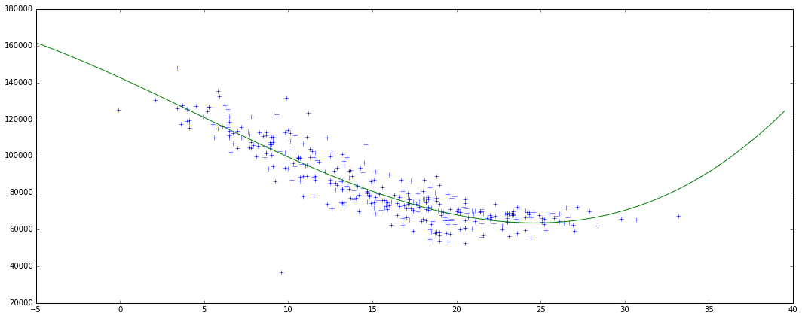
Tentative (moyennement fructueuse) d'approximer la relation entre **puissance et température**
par un **polynôme de degré 3**. On obtient de meilleurs résultats avec deux polynômes de degré 1
pour l'été et pour l'hiver.

### Conclusions de l'analyse
En conclusion, j'ai décidé de choisir les paramètres suivants comme paramètres
d'entré de mon modèle de prédiction à J+1:

 * puissance enregistrée la veille à la même heure
 * température prévue au moment où l'on fait la prévision
 * heure
 * jour de la semaine
 * numéro du jour dans l'année

Avec ces paramètres, même un modèle simple donne d'assez bons résultats.

## Établissement du modèle
Une fois les données d'entrées réunies et formatées, j'ai utilisé `scikit-learn`
pour créer un modèle et l'entraîner avec les données sources.

J'ai utilisé un modèle fondé sur les [machines à vecteur de support](http://scikit-learn.org/stable/modules/svm.html).

Une fois entraîné sur les données évoquées précédemment, il produit d'assez bons résultats.
Voilà un zoom sur quelques jours de décembre 2014:


On voit que l'ordre de grandeur des résultats est systématiquement le bon.
Cependant, certains jours (à partir du 29 décembre ici), les prédictions diffèrent
beaucoup plus que d'autres (jusqu'à environ 25%). Cet exemple permet de montrer les limites du modèle.
Ici, le 29 décembre au soir, il y a très visiblement eu un problème sur un poste
source voisin, qui a été déchargé sur celui-ci. Donc la consommation a brutalement
augmenté, alors que le modèle ne pouvait pas le prévoir. Il fait donc des prédictions
systématiquement sous-estimées, jusqu'à ce que la situation revienne à la normale
(jusqu'à ce que le poste voisin puisse reprendre la charge des habitations dont
il a la charge habituellement).


On voit ici que le modèle est plutôt bon en situation normale, mais tout à fait incapable de prévoir
les situations de crise, ou même les simple incidents. Il est important que ses
futurs utilisateurs en connaissent les limites.


## Déploiement
J'ai pris quelques jours de développement pour finaliser et déployer le modèle.
J'ai commandé un serveur à *service-AAA*, le service informatique interne d'ERDF qui
propose des serveurs CentOS avec un accès `root` accessibles sur tout l'intranet ERDF.

J'y ai installé MariaDB, python et ses bibliothèque scientifiques, apache et
mod_python.

J'ai développé un front-end très simple, en javascript, qui utilise la bibliothèque
[flot](http://www.flotcharts.org/) pour l'affichage de graphiques, et communique
avec le backend en python avec une simple API REST. J'ai réalisé un logo pour l'application.


Le résultat a une apparence correcte, mais encore très minimaliste, voire simpliste.

## Conclusion sur epythie
Le travail sur epythie était très intéressant, et très satisfaisant, surtout à la
fin, en se retrouvant face à l'interface graphique finalisée, et
indiquant des prévisions plutôt correctes.

Cependant, j'aurais aimé pouvoir y consacrer beaucoup plus de temps. Cette mission
aurait mérité d'y travailler à plein temps, et avec des spécialistes, et elle
n'a finalement été que l'un de mes différents projets de stage. J'aurais notamment
aimé avoir l'occasion de passer du temps à la validation du modèle, et au calcul
de paramètres optimaux, ainsi qu'à la quantification de l'influence de la météo
sur la consommation.

L'application a ainsi encore une grande marge de progression, depuis l'analyse
plus poussée des données
initiales pour fournir de meilleures prévisions, jusqu'à la réalisation d'une interface
graphique plus ergonomique, en passant par l'optimisation des performances.
On pourrait aussi envisager de nouvelles fonctionnalités, comme la prévision sur
le long terme, la catégorisation des postes sources par type de courbe de charge
(pour l'instant, la prédiction des valeurs d'un poste n'utilise l'historique
que de ce poste là), ou même la détection de fraudes en analysant les anomalies
dans la courbe de charge, au niveau des postes de distribution.


# Création d’APIs d’accès aux données

Lors de mon travail sur epythie, et ensuite sur d'autres projets, il y a une chose
qui m'a beaucoup manqué: une manière consistante, simple et documentée d'accéder
aux données générées et stockées par ERDF.

J'ai donc passé une petite partie de mon temps de stage, à chaque fois que j'en
avais besoin, à travailler sur des APIs simples et documentées, accessibles partout
dans l'intranet d'ERDF, et à essayer de faire la publicité de mes APIs, et d'une
telle pratique en générale auprès des autres développeurs et informaticiens que j'ai
pu rencontrer chez ERDF.

J'ai commandé un hébergement au service service-AAA d'ERDF pour faire héberger ce système d'API,
et sa documentation.

### Les APIs
Mon système est très simple. Il part du constat que la plupart des données
nécessaires dans la vie de tous les jours de l'ACR, et donc dans la plupart des applications,
est accessible sur DB-YYY, par une requête SQL, parfois un peu complexe.

J'ai donc créé une classe PHP qui gère tout ce qui était jusqu'alors réimplémenté
pour chaque application parfois plusieurs fois:

 * interprétation des paramètres de requête HTTP,
 * connexion à la base de données,
 * requête SQL avec les paramètres d'entrés (en faisant attention aux injections SQL),
 * affichage du résultat au format JSON.

```PHP
class SQLAPI{
  private $sql;
  private $args;
  private $dbName;
  protected $params;
  protected $db;

  public function __construct($sql, $args=array(), $db = FALSE) {
    $this->sql = $sql;
    $this->args = $args;
    $this->dbName = $db;
  }

  private function formatRow($row) {
    //Transformation to apply to every row of result
    return $row;
  }

  protected function formatResults($results) {
    // Par défaut, retourne les résultats dans un objet
    return array("results" => $results);
  }

  public function executeStatement($stmt, $params) {
    foreach($params as $k=>$v) {
      $stmt->bindValue(":$k", $v);
    }
    $stmt->execute();
  }

  public function resultString($results) {
    $res = json_encode($results);
    if ($res === FALSE) {
      throw new Exception(json_last_error_msg());
    }
    return $res;
  }

  public function contentType() {return "application/json";}

  private function getDBName() {
    if ($this->dbName !== FALSE) return $this->dbName;
    elseif (isset($_GET['db'])) return $_GET['db'];
    else return "DB-YYY-melun";
  }

  private function getDB() {
    $dbname = $this->getDBName();
    $dblisttxt = file_get_contents(__DIR__."/../config/databases.json");
    $dblist = json_decode($dblisttxt, true);
    $dbconf = $dblist[$dbname];
    return new PDO($dbconf['dsn'], $dbconf['user'], $dbconf['pass']);
  }

  protected function getParams($req_params) {
    $params = array();
    foreach($this->args as $i=>$argname) {
      $params[$argname] = $req_params[$i];
    }
    return $params;
  }

  public function fetchResults ($stmt) {
    $res = array();
    while($row = $stmt->fetch(PDO::FETCH_ASSOC)) {
      $res[] = $this->formatRow($row);
    }
    return $res;
  }

  public function handleQuery($req_params) {
    try {
      $this->params = $this->getParams($req_params);
      $this->db = $this->getDB();
      $this->db->setAttribute(PDO::ATTR_ERRMODE, PDO::ERRMODE_EXCEPTION);
      $stmt = $this->db->prepare($this->sql);
      $this->executeStatement($stmt, $this->params);
      $results = $this->fetchResults($stmt);
      $results = $this->formatResults($results);
      $stmt->closeCursor();
      header("Content-Type: ".$this->contentType());
      $resultStr = $this->resultString($results);
    } catch (Exception $e) {
      $resultStr = json_encode(array(
        "error" => $e->getMessage()
      ));
    }
    echo $resultStr;
  }
}
```
On peut ensuite étendre cette classe pour chacune des APIs requises, et on évite de
la duplication de code.

J'ai ensuite créé des APIs au fur et à mesure, pour les données dont j'avais besoin,
ou dont mon collègue Yann avait besoin.

### Le wiki de documentation
J'ai créé un wiki grâce à [dokuwiki](https://www.dokuwiki.org/dokuwiki#), où
j'ai indiqué pour chaque point d'API créé comment s'en servir, et le format
sous lequel les données sont retournées. Tous les développeurs d'ERDF intéressés
peuvent contribuer.

# DRIM'IN Saclay: travail sur l’élagage à proximité des lignes électriques

J'ai eu l'occasion, grâce à mon maître de stage, de participer pendant trois
jours à la *convention d'Open Innovation* [Drim'in Saclay](http://www.driminsaclay.com/le-concept),
organisée notemment par la chambre de commerce et de l'industrie sur le campus de l'École
polytechnique.

## L'évènement

Drim'in Saclay, c'est un évènement de trois jours, sur le thème de l'énergie,
qui fait se réunir des grands comptes (EDF, ERDF, GRDF, Air liquide...), des startups,
des étudiants, pour les faire travailler en petite équipe sur des *défis* définis
à l'avance.

## L'équipe
### Le défi
Le défi qui nous a été attribué, à moi et mon équipe, était la gestion de la végétation
à proximité des lignes électriques.

### Les membres
J'ai travaillé en équipe avec deux personnes qui venaient de créer une startup
qui faisait du matériel technologique de surveillance et gestion des jardins,
un élagueur, une représentante de l'union des entreprises du paysage, et un
spécialiste de la gestion de patrimoines arborés.

Les deux créateurs de startup et moi étions les seuls à avoir un profil technique/informatique.

## Le projet
Nous avons décidé, pour innover dans le domaine, de ne pas seulement proposer un
projet différent d'élagage au bord des lignes, comme c'est fait actuellement,
mais de proposer une manière nouvelle et écologique de gérer le patrimoine
biologique au bord des lignes.

### Situation actuelle
Aucun arbre ne doit jamais toucher une ligne électrique haute tension, sous
peine de risquer de faire un court circuit, et de plonger des habitations dans le noir.
Hors ERDF possède de très longues portions de ligne bordées de végétation, et
doit ainsi faire
élaguer en France chaque année 30000 kilomètres le long de ses lignes.
Chaque mètre à élaguer est facturé entre 1,7 et 3 €, auxquels il faut ajouter le
prix de mise hors tension des lignes, de supervision de chantier et d'inventaire.

L'élagage actuel est souvent "brutal", à savoir que l'on coupe simplement
les branches qui dépassent, sans considération pour le type de végétation et ce
qui est bon pour chaque arbre. Cela coûterait trop cher.

Les élagueurs n'aiment en général pas travailler avec ERDF.

### Solution proposée
Nous avons travailler sur une solution qui soit à la fois moins coûteuse et plus
écologique, pour la proposer à ERDF dans le cadre du concours.


Nous proposons la création d'une plateforme informatique de gestion et
observation de la végétation, accompagnée de la création d'espaces naturels
adaptés autour des lignes.

#### Création de zones de végétations adaptées
Le but est de progressivement créer des espaces d'observation de la nature
autour des lignes. Dans ces espaces une végétation spécifique sera plantée,
qui ne sera pas dangereuse pour les lignes et ne nécessitera pas d'élagages.
Les communes pourront participer à la création de ces espaces, dans le but de
faire découvrir la nature qui les entoure à leurs administrés. Ces espaces
pourront recevoir la visite d'écoles et d'associations d'enthousiastes de la
nature.

Elles contribueront également à changer l'image plutôt négative d'ERDF auprès
des écologistes.

#### Création d'une plateforme de récolte et gestion des données
Dans la plupart des zones, l'élagage restera nécessaire. Nous
proposons la pause de capteurs, qui permettent en même temps de relever des
données sur l'écosystème entourant les lignes et de détecter les situations
dangereuses où les arbres s'approchent des lignes. Encore une fois, ERDF
n'est pas le seul gagnant.

Les données relevées par ces capteurs seront relevées sur une plateforme publiquement
accessible, sur laquelle les citoyens pourront eux-mêmes signaler les
situations dangereuses lorsqu'ils en croisent. Ainsi, il deviendra facile de signaler
un arbre de son jardin qui s'approche dangereusement des lignes et de le faire
élaguer par ERDF.

## Résultat
Le jury a été enthousiasmé par notre présentation, et nous a remis le
"prix de la créativité" du concours.

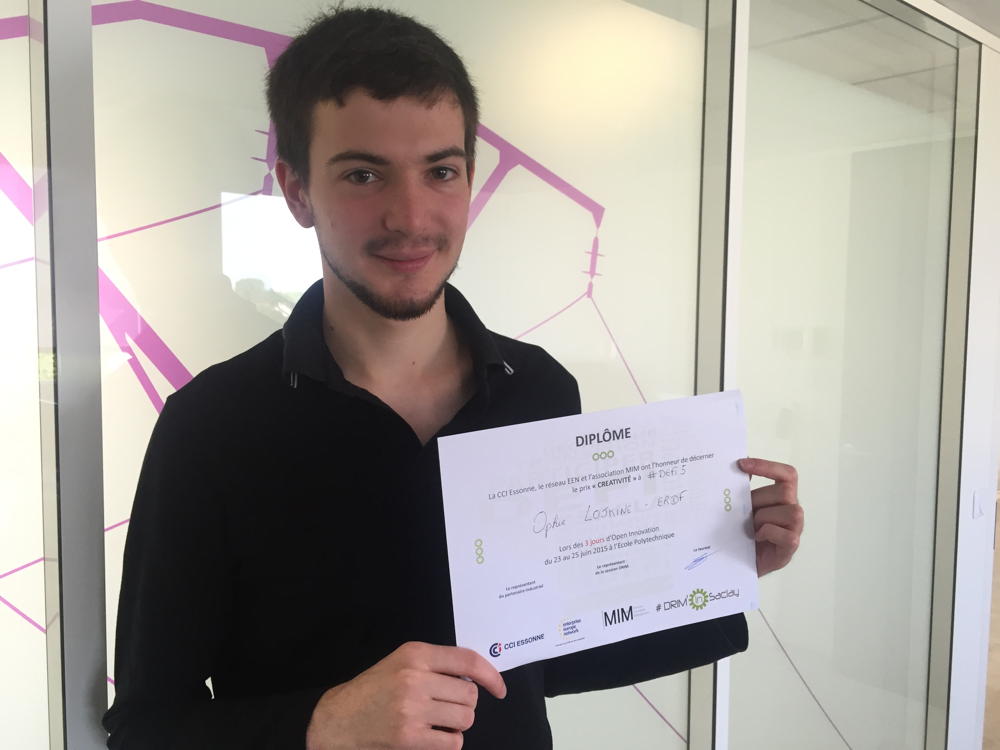

Cependant, mettre en place un tel plan demande une coordination de plusieurs
services chez ERDF, et le changement de plusieurs pratiques actuelles.
On ne peut ainsi pas véritablement s'attendre à la mise en place du projet
dans un futur proche.

# Hackathon ERDF
Les 7 et 8 juillet, j’ai eu l’occasion de participer à un évènement exceptionnel
au sein d’ERDF: le premier *hackathon* interne national d’ERDF.

On appelle habituellement hackathon un rassemblement de jeunes développeurs qui
travaillent par petite équipe durant un week-end entier, généralement le jour et
la nuit, et qui sont en compétition pour obtenir une récompense, ou une gratification
à la fin du weekend.

L’évènement organisé par ERDF, étant organisé par une entreprise pour ses employés,
ne pouvait répondre totalement à cette définition. Il était organisé en semaine,
uniquement pendant la journée, et des employés de différents horizons étaient présents,
y-compris des personnes moins familières avec l’outil informatique.

Ainsi, l'objectif n'était pas uniquement de créer de nouvelles applications pour
l'entreprise, mais aussi de penser les nouveaux usages de l'informatique, les
nouvelles pratiques et les nouveaux *process* qui pourraient être mis en place
grâce à l'outil informatique.

Le processus de création se déroulait par équipes, qui pouvaient avoir été
formées avant le début de l'évènement.
Je m'étais moi-même inscrit avec Yann, mon collègue développeur de l'**ACR**.
Nous voulions un projet assez ambitieux, qui réponde à un véritable besoin au
sein de l'entreprise (et non seulement dans notre agence), mais qui soit cependant
de taille et de complexité assez raisonnable pour pouvoir coder une démo complète
et fonctionnelle en seulement deux jours.

## Création d’une application de gestion des postes de transformation HTA-BT

Après avoir discuté notemment avec Sylvain Jouhanneau, mon maître de stage et
directeur de l'ACR, nous avons choisi sur quoi allait porter le développement
lors de ce Hackathon. Elle allait être destinée à rendre plus efficaces et moins
dangereuses les interventions sur les postes HTA-BT.

### Exposé du problème à résoudre
Les postes HTA-BT, derniers postes de transformation du réseau ERDF sur le chemin
de l'électricité avant l'arrivée chez le client, sont très nombreux. Les
interventions les concernant sont donc nombreuses et fréquentes, et se doivent
d'être rapides et fiables.

L'un des points à améliorer de ces informations mis en avant par mon supérieur
était la manière dont les techniciens trouvent les postes, et les informations
concernant les postes auxquelles ils ont accès au moment de l'intervention.

Les deux problèmes principaux étant que:

 * les techniciens ont parfois du mal à **trouver physiquement le poste**
une fois arrivés à l'adresse à laquelle on leur a indiqué que l'intervention
devait avoir lieu.
 * ils ignorent parfois des **informations importantes sur le poste**. Par exemple,
ils ne disposent pas toujours de l'historique des interventions passées.

## Solution proposée
### Cahier des charges
Nous avons décidé la création d'une application mobile que les techniciens
pourraient directement consulter depuis leur téléphone mobile personnel.
La quasi-totalité des techniciens a un smartphone, et leur usage est autorisé
pendant le travail, et à l'intérieur des postes HTA-BT.

Notre application devait pouvoir géolocaliser l'utilisateur pour l'aider à
trouver un poste HTA-BT très rapidement, devait lui présenter toutes les
informations connues sur le poste (même issues de plusieurs systèmes d'information
différents), et enfin, permettre la communication entre techniciens, en les
autorisant à laisser des notes destinées aux prochains techniciens à intervenir
sur le même poste.

### Solution technique
Le hackathon était pour mon collègue programmeur de l'ACR et pour moi à
la fois une occasion de sortir du travail et des missions du quotidien,
et donc d'expérimenter de nouvelles technologies, et une période de travail intense
en seulement quelques jours, où nous nous devions d'être productifs.
Nous avons donc essayé de faire des choix technologiques qui seraient à la fois
nouveaux pour nous, et que nous pourrions maîtriser rapidement.

Nous avons donc décidé d'utiliser les langages **Javascript** et **PHP**, la base
de données **MySQL**, et le framework CSS **bootstrap**, que nous maîtrisions déjà. Nous avons décidé d'une **interface
graphique simple** voire sommaire, composée du nombre minimal d'écrans différents
nécessaires à remplir le cahier des charges. Comme c'est courant dans ce genre
d'évènements, la relecture de code est passée au second plan, et nous nous sommes
attribués des rôles bien définis dont nous ne sortirions pas: à moi le *front-end*,
à lui le *back-end*.  

En contrepartie, nous nous sommes autorisé un *front-end* en **AngularJS**,
et un *back-end* fondé entièrement sur des **APIs REST**, ce qui différait des
développements habituels de l'ACR. Nous avons aussi été amenés à utiliser et tester
[l'API Javascript de géolocalisation des navigateurs](https://developer.mozilla.org/en-US/docs/Web/API/Geolocation).

**AngularJS**, le framework d'application *mono-page*
de Google, permet à la fois le prototypage rapide d'application dont nous avions
besoin, et une  bonne maintenabilité du code. Son langage de template est très
simple, et il n'y a presque pas de *boilerplate* à écrire pour une nouvelle
application. Sa documentation est détaillée, et pleine d'exemples. J'ai donc
jugé que ce serait un bon choix à la fois pour apprendre à utiliser un nouveau
framework, et compléter le développement de notre application (assez simple)
dans le temps imparti.

Comme on l'a vu plus haut, la création d'**APIs** d'accès aux données
était un véritable enjeu chez ERDF, et réaliser de bonnes APIs, simples mais
assez expressives était un très bon objectif à se fixer pour ces deux jours.
Mon collègue avait rarement été amené à réaliser toute une API cohérente auparavant,
et cette occasion était à saisir.

### Interface graphique

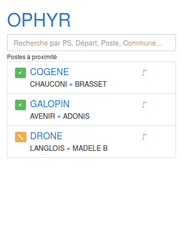

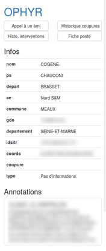

Comme nous l'avions dit, nous voulions une interface très simple.
Nous avons décidé de deux écrans successifs à afficher:

 1. Un premier qui contient une liste des postes HTA-BT environnants et leur état,
 dans laquelle l'utilisateur peut faire une recherche.
 1. Un deuxième qui contient toutes les informations nécessaires sur le poste,
 sous forme de tableau, et permet de visualiser les notes laissées par les autres
 techniciens, ainsi que de laisser son propre commentaire.


## Déroulement des deux jours de développement
Le développement devait commencer très vite, et nous nous y sommes donc mis
dès que nous avons finalisé nos choix techniques, au milieu du premier jour.

##### Jour 1
Nous avons commencé par la réalisation de l'écran d'accueil, qui liste les postes
environnants. Le développement s'est bien passé, notre peur d'être submergé face
à ce nouveau mode de fonctionnement s'est vite estompée. À la fin du premier jour,
l'écran d'accueil listait les postes environnants et leur état dans une interface
graphique adaptée aux petits écrans, le premier *endpoint* de notre API était
fonctionnel, grâce à un responsable informatique d'ERDF présent à l'évènement
qui nous a indiqué comment récupérer les données de géolocalisation des postes
sur le réseau.

##### Jour 2
Le second jour a été intense, mais sans grosse surprise.
Le plus dur fut probablement d'apprendre à faire fonctionner le système
de [*routes*](https://docs.angularjs.org/api/ngRoute/service/$route) d'angular,
que je n'avais jamais utilisé avant. Mais une fois maîtrisé, il permet d'avoir
une belle application mono-page, qui se charge rapidement, et qui associe à chaque
état de l'application une URL unique et partageable. Mon collègue a aussi bien
avancé sur les APIs, de manière que nous étions assez satisfaits de notre application
à la fin de la journée pour arrêter le développement et commencer la préparation
de la démonstration que nous allions devoir faire aux autres participants.

## Présentation finale
Nous avons présenté notre résultat devant un jury composé de membres du groupe ERDF
et d'experts d'entreprises partenaires.

Malheureusement, nous n'avons pas gagné de prix, ceux-ci ayant été attribués à de
plus grosses équipes ayant travaillé à des projets plus ambitieux, quitte à ne
pas présenter de démonstration fonctionnelle.

Cependant, le résultat est très positif pour nous, puisque nous avons atteint notre
objectif en deux jours, et nous espérons maintenant que l'application sera
finalisée, testée, puis mise sur le terrain.  

### Publication du code
Nous avons depuis publié tout le code source qui pouvait l'être sans enfreindre
la politique de partage des données de l'entreprise. Le résultat est sur Github
dans le dépôt [lovasoa/HTAgBT](https://github.com/lovasoa/HTAgBT).

# Méthodes innovantes de visualisation de données
Mon maître de stage était très intéressé par l'innovation au sein de l'ACR en
général, et les méthodes innovantes de visualisation de données en particulier.

J'ai ainsi été amené à réaliser deux applications de taille modeste, mais au
rendu final assez intéressant, destinées à offrir une manière plus intuitive,
plus rapide, et plus esthétique d'accéder à certaines données.

Ces réalisations étaient principalement destinées aux démonstrations à l'intention
des visiteurs de l'ACR, mais aussi du personnel.

## Courbe de charge "en horloge"
L'ACR est en charge d'un certain nombre de postes sources. Chacun fournit une
puissance qui varie en fonction de la demande énergétique des clients qui
dépendent du poste.

Dans la base de données *DB-YYY*, on trouve les valeurs de puissance totale
de chaque poste source, et la valeur cumulée pour tous les postes de l'ACR à
intervalle régulier.

L'objectif était ici d'inventer une manière innovante et attrayante de présenter
ces données, qui pourrait être présentée notamment sur les écrans de l'agence et
au public en visite à l'ACR.

### Idée générale
L'idée fut de réaliser un petit *widget*, qui pourrait être intégré dans d'autres
pages, et qui prendrait la forme d'une horloge analogique.

Cette horloge, au lieu d'indiquer simplement l'heure, indiquerait aussi
l'historique récent de la puissance distribuée. Cela permettrait de visualiser
très rapidement les pics de consommation et la situation globale.

L'horloge prend la forme d'un disque noir. Seule l'aiguille des heures est
représentée. Toutes les 5 minutes, l'aiguille laisse une nouvelle trace en forme
de barre sur le cadran. La taille et la couleur de la trace dépendent de la
puissance distribuée. Toutes les douze heures, à midi et à minuit, les
anciennes traces sont effacées.

Le résultat est comme suit.

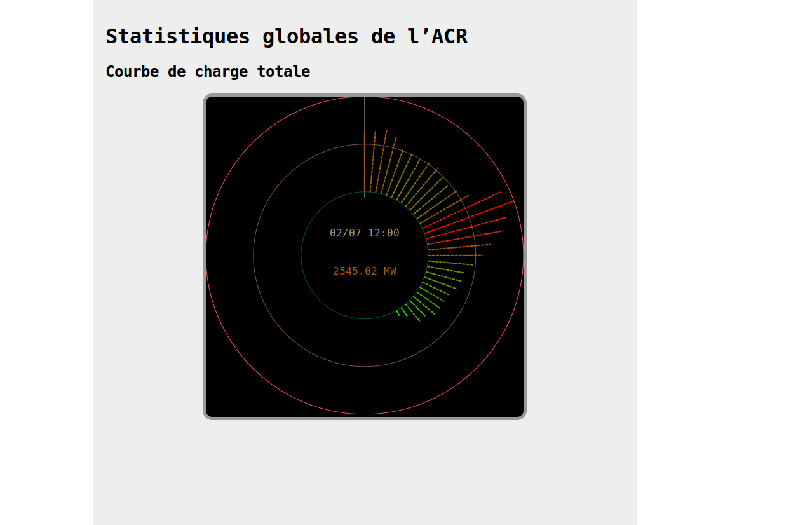

### Réalisation
J'ai décidé de découper ce petit projet en deux:

 * Une bibliothèque javascript générique pour ce type de représentation graphique "en horloge".
 * Un petit script qui récupère les données et les fournit à la bibliothèque.

Le petit résultat final a été intégré à la liste des outils de l'ACR, il
est disponible pour tout le monde sur l'intranet et a été intégré sous forme
de *widget* en petit format à la page d'accueil du portail intranet de l'agence.

#### Bibliothèque *roundplot*
La bibliothèque est une bibliothèque javascript générique; elle fonctionne avec
n'importe quelle série temporelle. Elle est écrite en javascript, suivant la
syntaxe [ecmascript 6](https://fr.wikipedia.org/wiki/ECMAScript).
Elle permet à l'utilisateur de définir le temps représenté sur le cadran (une minute, une heure, une journée...), la manière de formater les dates et les nombres, et
la palette de couleurs à utiliser.

Elle se fonde elle-même sur la bibliothèque javascript [D3.js](https://d3js.org/),
qui permet de créer des documents dynamiques et réactifs.
L'horloge elle-même est rendue dans le navigateur sous forme d'un
[SVG](https://www.w3.org/Graphics/SVG/) (un dessin vectoriel).

J'ai publié cette bibliothèque sur Github:
[https://github.com/lovasoa/roundplot](https://github.com/lovasoa/roundplot)

## Les pingouins: "Ensemble, refroidissons la planète"
L'idée du *projet pingouins* a germé lors d'une réunion mensuelle de l'agence,
la première à laquelle j'ai été convié. Sylvain Jouhanneau, le directeur de l'ACR, faisait
remarquer que les outils dont nous disposions, bien qu'en général très puissants,
étaient très compliqués, et avaient une interface peu attractive, ce qui les rendaient
impossible à présenter au public à des fins de sensibilisation. Il a ensuite
évoqué une visite profesionnelle qu'il avait faite dans un centre de distribution
électrique au Japon. Là-bas, ils avaient créé à destination du grand public un outil
graphique amusant dans l'objectif de sensibiliser les ménages au lien entre leur
consommation énergétique et le réchauffement climatique. L'outil japonais consiste en un
simple écran sur lequel est présentée une petite animation représentant cinq pingouins
sur une petite banquise. Lorsque la consommation du ménage augmente, la banquise
virtuelle fond, et les pingouins tombent à l'eau un par un. L'outil était simple et
marquant, et avait plu partout où il avait été présenté.

Notre projet était de produire une représentation dynamique du même type, avec la
même dimension pédagogique et ludique à la fois, adaptée à notre agence de conduite.

### Que représenter ?
Une information très importante à connaître à l'ACR à tout moment est la charge
totale de chacun des postes sources. Les situations de crise correspondent à des
moments ou plusieurs postes sources doivent fournir une puissance très importante.
Un bon indicateur de l'état de santé de l'ACR est donc la liste des postes sources,
avec les puissances actuelles et souscrites associées. Il a donc été décidé de
présenter cette information là dans notre représentation graphique innovante.

### Comment le présenter ?
Nous avons décidé de garder le même animal que dans l'idée originale, pour son
caractère mignon, et emblématique du réchauffement climatique.

Ensuite venaient les questions d'ergonomie. Il fallait une représentation plaisante,
amusante, globalement compréhensible par les visiteurs de l'agence même moins initiés,
mais qui permette de se représenter en un clin d'œuil l'état général des postes de
l'agence, l'état d'un poste en particulier, et si possible d'avoir accès aux données
chiffrées.

J'ai donc décidé de présenter le tout sous forme d'une carte navigable de toute
la région Île-de-France Est, avec à chaque emplacement de poste source un petit
pingouin. L'état du pingouin dépend de la charge du poste source.

 * Si le poste n'est pas utilisé du tout, ou très peu (il a été déchargé sur un
autre, par exemple), alors le pingouin dort.
 * Si le poste délivre une puissance comprise entre 20 et 70 pourcents de la
puissance souscrite qui lui est associée, il a une expression neutre, et sa couleur
varie du blanc au jaune.
 * Entre 70% et 100% de la puissance souscrite, le pingouin prend un air triste,
et devient orange.
 * Si le poste source est utilisé au delà de sa puissance souscrite (ERDF paye
une pénalité à RTE pour ce poste), le pingouin a l'air mort, et il est tout rouge.


Lorsque l'on clique sur un pingouin, sa *banquise* s'affiche en surbrillance
sur la carte. Elle correspond à la zone géographique déservie par le poste,
c'est-à-dire toute la zone dans laquelle il y a des habitations qui dépendent
du poste.

### Réalisation technique et technologies utilisées

#### Structure de l'application
L'application est très simple, composée d'un *front-end* en javascript et un
back-end en PHP.

Le *front-end* est écrit en javascript simple, sans *framework*, et utilise la
bibliothèque [leaflet](http://leafletjs.com/) pour le rendu de la carte navigable.
Le fond de carte utilisé est celui d'[OpenStreetMap](https://www.openstreetmap.org/),
une carte du monde libre et collaborative. Il utilise des
[`XMLHttpRequest`](https://developer.mozilla.org/fr/docs/Web/API/XMLHttpRequest)
pour communiquer avec le *back-end*. J'ai implémenté en javascript l'algorithme
du [parcours de Graham](https://en.wikipedia.org/wiki/Graham_scan) pour afficher
la zone de banquise des pingouins à partir de la liste des coordonnées de tous
les postes HTA-BT dépendants d'un poste source. J'en ai fait
une petite bibliothèque javascript, que j'ai
[publiée sur NPM](https://www.npmjs.com/package/graham-fast).

Le *back-end* en PHP est très simple aussi, il se contente de faire les requêtes
à la base de données MySQL, de normaliser les résultats, et de les retourner
au format JSON. La principale chose à normaliser est le format des coordonnées
géographiques contenues dans la base de données. Elles sont enregistrées
au format [Lambert93](https://fr.wikipedia.org/wiki/Projection_conique_conforme_de_Lambert),
et non [GPS](https://fr.wikipedia.org/w/Global_Positioning_System).
J'ai écrit une bibliothèque PHP pour convertir entre ces formats, et l'ai
[publiée sur Github](https://github.com/lovasoa/lambert2gps-php). Elle
est fondée sur [une autre bibliothèque libre](https://github.com/joffreykern/LambertToGps),
écrite en `.NET`.

#### Base de données
Les informations nécessaires à l'affichage des pingouins sur la carte sont contenues
dans la base de données `DB-YYY`, dans les tables suivantes:

 * `TABLE_TTT` : valeur des puissances instantannées des différents ouvrages du
réseau, dont les postes sources.
 * `TABLE_TTT_PADT` : puissances souscrites des postes.
 * `OUVRAGE` : informations sur les postes de transformation du réseau. Les postes
 sources ont le *type de poste* `PAGC`.
 * `ELEMENT_TOPOLOGIQUE` : tous les éléments physiques du réseau, et leurs *coordonnées
Lambert*.
 * `TM` : permet d'obtenir l'unité des nombres retirés des tables `TABLE_TTT_*`.

##### Requête SQL

```
supprimé
```

### Résultat
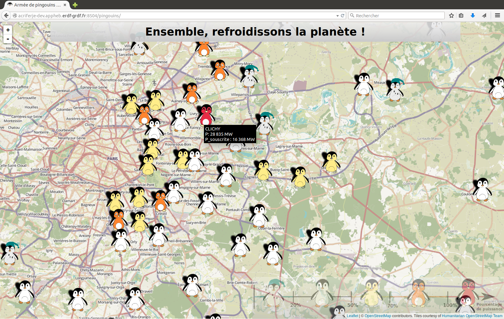
Sur cette capture d'écran, la souris survole le poste source "Clichy", et les informations associées sont affichées: on voit que le poste délivre environ 2MW de plus que la puissance souscrite qui lui est associée.

## WBO, tableau blanc interactif
Les *conducteurs* [^conducteur] ont souvent besoin de communiquer entre eux,
pour se tenir au courant de la situation du réseau rapidement, signaler les
situations à risque, communiquer sur ce qu'il se passe, demander aux autres
de faire quelque chose ou au contraire de ne pas toucher à une partie du réseau.
Pour la communication entre ses collaborateurs, ERDF utilise un système de messagerie
instantannée propriétaire d'IBM, accessible sur tous les postes reliés à l'intranet.
Cependant, ce système n'est pas vraiment fait pour conserver des informations sur
la durée, les mettre en page, ou les accompagner de schémas.

[^conducteur]: conducteur : agent de conduite du réseau, travaillant à l'ACR

J'avais déjà réalisé, comme projet personnel, un tableau blanc interactif en
ligne et en temps réel, que j'avais nommé [WBO](https://github.com/lovasoa/whitebophir).
En en parlant avec le directeur de l'ACR, et avec des conducteurs, ils ont
été très enthousiasmés, et m'ont demandé de l'améliorer et de le déployer sur
l'intranet.

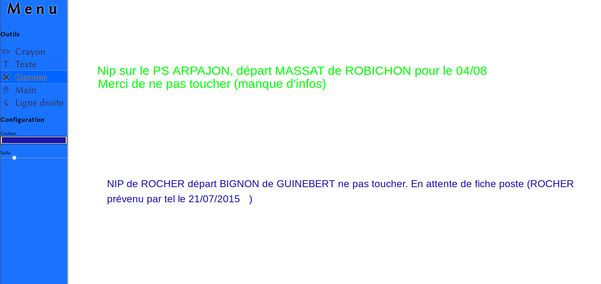

Le projet est constitué d'un backend en [node.js](https://nodejs.org/en/) qui
utilise des
[websockets](https://developer.mozilla.org/en-US/docs/Web/API/WebSockets_API)
pour communiquer avec un front-end en javascript. Le front-end affiche le
tableau en temps réel dans le navigateur en SVG et permet de dessiner et écrire
dessus. Chaque outil est indépendant, codé en javascript et assez simple.
Le cœur, qui gère la distribution des évènements de dessin et la communication
avec le serveur, ne fait que 400 lignes de javascript.

Dans le cadre de mon stage, j'ai notemment
[rendu le code compatible avec Internet Explorer](https://github.com/lovasoa/whitebophir/commit/8bb9479972056ac99eba1148693eee1c67fafca7),
[traduit l'interface en français](https://github.com/lovasoa/whitebophir/commit/dc461b52f3e4179b399089e5ca1c09244b3eba7e),
et [ajouté un outil de dessin de lignes droites](https://github.com/lovasoa/whitebophir/commit/fd9657304f39ab4450a65c809cc4aa0847ab70b3).

J'ai ensuite déployé l'application sur un serveur intranet service-AAA, où j'ai
installé node.js.

# Conclusion
## Travail accompli et compétences acquises
Le stage ne s'est pas déroulé comme je l'imaginais. Je pensais passer tout
mon temps sur le développement du modèle de prédiction des courbes de charge,
et ça n'a finalement occupé qu'une partie de mon stage. Cela signifie que
le modèle n'est pas aussi abouti que ce que j'espérais, mais cela signifie
aussi que j'ai eu le temps de travailler sur de nombreux autres projets intéressants
et de rencontrer beaucoup de gens.

J'ai notemment passé une grande partie de mon stage à faire du développement web,
principalement front-end en javascript, mais aussi back-end en PHP, python
et node.js. J'ai appris à utiliser de nouveaux outils et frameworks, comme
AngularJS et bootstrap.

J'ai regretté de ne pas avoir l'occasion de passer de temps avec un
ingénieur en informatique, et je me suis parfois senti seul sur des questions
techniques, comme l'accès aux bases de données non documentées, les choix
des outils et algorithmes pour l'analyse de données, ou la configuration des
serveurs CentOS fournis pour l'hébergement sur l'intranet. D'un autre côté,
j'ai beaucoup appris, et pense avoir gagné en autonomie. Et les autres
membres de l'ACR étaient toujours présents et enthousiastes pour m'expliquer
comment fonctionne le réseau électrique, comment l'entreprise est organisée,
et même quelles bases de données utiliser.

## Mon expérience humaine au sein d’ERDF
Je pense avoir encore plus appris sur le plan humain, et sur le fonctionnement
du monde de l'entreprise que sur le plan technique.

ERDF est une entreprise très accueillante, et de manière générale, les salariés
que j'ai rencontrés étaient prêts à aider, à expliquer, et enthousiastes
envers l'innovation. J'ai cependant appris qu'une énorme machine comme ERDF a un très gros
*moment d'inertie*, et que les choses, malgré toutes les bonnes volontés, bougent
très lentement.

Je suis très reconnaissant envers mon collègue Yann Le Hervé d'avoir passé autant
de temps avec moi, prenant de son temps de travail et sur son emploi du temps
toujours chargé du temps pour m'expliquer tout ce que je voulais savoir sur
le fonctionnement parfois complexe de l'informatique au sein de l'entreprise.

Je remercie également Sylvain Jouhanneau, mon maître de stage, pour m'avoir donné
tant d'opportunités, m'avoir fait participer à tant de projets différents.
J'ai découvert grâce à lui une grande partie de l'entreprise, et non seulement
l'ACR dans laquelle j'étais venu faire mon stage.

J'envisage aujourd'hui sérieusement, parmi d'autres options, de candidater dans
l'entreprise pour y commencer ma carrière. L'usage de l'informatique au sein
d'ERDF se développe très vite, et participer à cette évolution est passionnant
et motivant.
