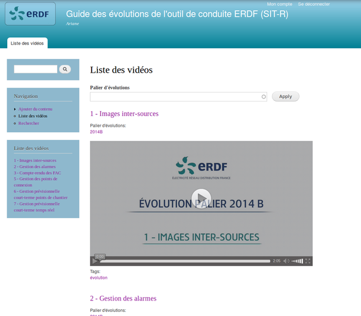
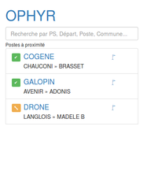
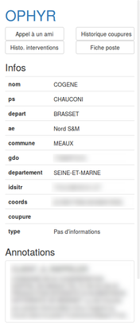
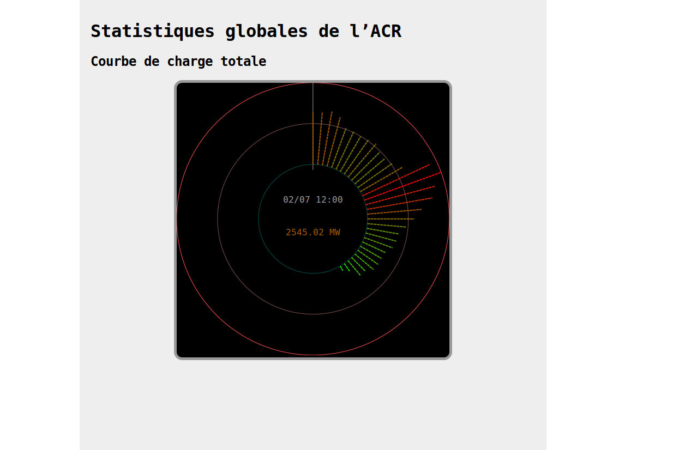
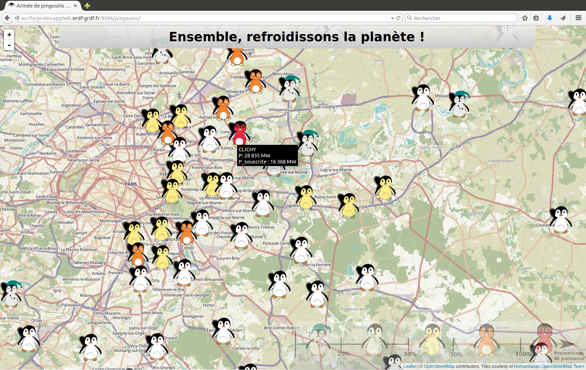
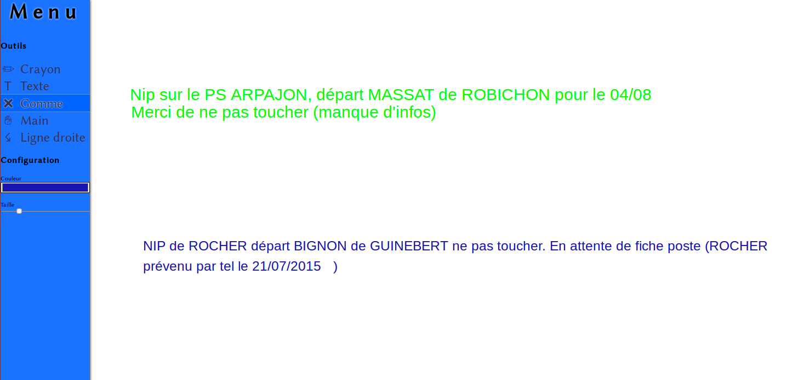

# Rapport de stage

# Remerciements
Je tiens à remercier mon maître de stage, Sylvain Jouhanneau,
pour son suivi régulier de mon stage, les projets intéressants qu’il m’a proposés,
et les personnes qu’il m’a permis de rencontrer.

Je remercie également Yann Le Hervé, mon collègue programmeur au sein de l’ACR,
pour son aide quotidienne, ses réponses toujours rapides et précises à toutes
mes questions sur le réseau élecrique et la srtucture des bases de données dont
j’avais besoin.

Enfin, je remercie toute l’équipe de l’ACR, et en particuliers les préparateurs
pour leur accueil chaleureux et leur sympathie.

# Introduction
## Présentation de l’entreprise
### EDF - ERDF
Pour comprendre le contexte de mon stage, et les enjeux des missions que j’ai
effectuées, il faut comprendre le rôle d’ERDF dans le réseau électrique français.

À sa création après guerre, EDF (Électricité De France) avait un monopole sur
la production, le transport et la distribution d’électricité. L'ouverture
progressive du marché de l’électricité entre 1999 et 2008 pousse EDF a créer
des filiales qui ont chacune un domaine d’activité restreint et bien défini.

C'est ainsi qu'en 2000 est créé **RTE** (pour Réseau de Transport d'Électricité),
filiale d’EDF chargée du transport de l’électricité. RTE se charge de transporter
l'électricité à très haute tension depuis son lieu de production sur de longues
distances, jusqu'à l'entrée en zone urbaine.

En 2008 est créée la filiale **ERDF**,

### L’ACR
## Glossaire
#### ACR
**A**gence de **C**onduite **R**égionale, service d’ERDF chargé de surveiller en temps réel
l'état du réseau électrique, et de s’assurer que les clients soient alimentés
en permanence, même lorsqu'un incident survient. Pour cela, elle peut visualiser
la totalité du réseau de la région dont elle a la charge, peut actionner certains
interrupteurs à distance, et est en contact téléphonique avec les agents du terrain
pour manœuvrer les parties du réseau qui ne sont pas télécommandées.

### Les agents
#### Conducteur
Agent de l’ACR qui *conduit* le réseau. Il effectue à l'aide d'un logiciel
appelé **outil de conduite** les manœuvres nécessaires pour
rétablir le courant chez les clients, ou au contraire pour mettre une portion hors
tension avant des travaux.

#### Préparateur
Agent de l’ACR chargé de la préparation de chantiers sur le réseau. Il prépare la
liste de manœuvres que devra effectuer le conducteur.

### Types de courant
#### BT
Basse tension, entre 50 et 1000 volts. Il est sous la responsabilité d’ERDF,
mais n’est pas piloté par l'ACR.

#### HTA
Haute tension de *type A*, entre 1 et 50 kilovolts. C'est à cette tension
qu’opère le réseau électrique piloté par ERDF.

#### HTB
Haute tension de *type B*, au delà de 50 kilovolts. C'est à cette tension qu’opère
le réseau électrique piloté par le **RTE**.

### Les éléments du réseau
#### Poste source
Poste de transformation de la HTB vers la HTA. Un poste source contient plusieurs
ouvrages différents. Il est installé sur un terrain de plusieurs milliers de mètres
carrés. L'intensité du courant qui transite par un poste source varie en permanance
en fonction de la demande en électricité, pour une puissance totale de plusieurs
dizaines de mégawatts, alimentant des milliers de clients.
L’ACR d'Île de France Est contrôle 83 postes sources, sur quatre départements.

#### Télémesure, ou TM
Outil mesurant en temps réel une puissance. Cette donnée est affichée en temps
réel dans l’outil de conduite des conducteurs, et est archivée avec un pas de
dix minutes dans une base de données, elle aussi accessible en lecture depuis
l’ACR.

#### Départ
Une ligne électrique sortant d’un poste source. Chaque poste source contient de quelques
départs à quelques dizaines de départs. Les départs peuvent le plus souvent être
*repris* les uns par les autres, c'est-à-dire qu'une portion de réseau faisaint
partie d'un départ peut être alimentée par un autre départ lorsqu'un incident
survient. Pour chaque départ, on dispose d’une télémesure.

#### Poste HTA-BT
Poste de transformation de la HTA vers la basse tension. Ils sont beaucoup moins
imposants que les postes sources (quelques mètres carrés, quelques centaines de
kilowatts), mais beacoup plus nombreux (quelques centaines de milliers en Île-de-France Est).
On ne dispose pas aujourd’hui de télémesures indiquant en temps réel la puissance
de ces postes.

#### Autres
Le réseau contient des dizaines de types d’ouvrages différents, je n’ai décrit ici
que ce qui vous sera utile pour la poursuite de la lecture de ce rapport...

## Organisation, stockage, et traitement des données chez ERDF
Le but de cette partie n’est pas de faire une liste exhaustive des outils informatiques
et bases de données d’ERDF, dont je ne maîtrise qu’une infime partie, mais d’expliquer
comment est organisé la partie du système d’informations qui concerne l’ACR, et
avec laquelle j’ai été ammené à interagir. Cela évitera d’avoir à redéfinir le
rôle de chaque outil chaque fois qu’il sera mentionné.

### Les données

On parle ici des données récoltées sur le réseau éléctrique en temps réel (comme les valeurs des télémesures,
les incidents, les changements de structure),
mais aussi des données qui se mettent à jour moins souvent comme la liste des clients, la liste
des ACR de France, le schéma normal, le nom des postes sources et de leurs départs.

### Système d'accès aux données

#### Où sont-elles?
Les données reçues des postes sources, le schéma du réseau, et les données de configuration saisies
par les configurateurs sont stockées et traitées sur le **SIT-R**.

Le *SIT-R* exporte certaines de ses données régulièrement et automatiquement
sur la base de données MySQL **EtaReso**, et c'est cette base qui est utilisée par les applications.

Toutes les données ne sont pas dans *EtaReso*, et la structure de la base de données
n'est pas documentée.

On peut récupérer certaines données concernant le schéma du
réseau dans le fichier **Geocutil**.

D'autres données encore ne sont pas accessibles du tout en dehors des postes des conducteurs.

#### Comment y accède-t-on?
Les outils développés par le *GTAR* (entité informatique nationale d’ERDF)
ont accès à toutes les données du *SIT-R*.
Ces données sont cohérentes entre elles et les personnes qui développent ces outils
connaissent la structure des données dans le SIT-R.

Les outils développés dans les ACR ou par des prestataires, par contre, ont
également besoin des données, mais ne peuvent pas les utiliser directement.
Ils utilisent donc les extractions des données du SIT-R, comme la base
EtaReso ou le fichier GeocUtil.

# Sujet du stage
J’ai été recruté au sein de l’ACR d'Île-de-France Est en tant que stagiaire
*data-scientist* (spécialiste de l’extraction, du traitement, et de la visualisation
de données), dans le but de développer un algorithme de prédiction des valeurs
de puissance des postes source.

J'ai pour cela utilisé un modèle fondé sur les **SVM** (machine à vecteur de support),
implémenté dans le langage Python, et dont les résultats sont visualisables dans
une interface web.

Mais mon stage m’a aussi poussé à découvrir de nombreuses autres problématiques
liées à l'informatique chez ERDF, et à répondre à certaines d’entre elles.

Je présente donc dans ce rapport toutes les missions les plus importantes sur
lesquelles j’ai travaillé, même si beaucoup ne sont pas en rapport direct avec
mon sujet de stage initial.

# Travail réalisé

## Ariane, site de présentation des évolutions de l’outil de conduite du réseau

### Contexte
En arrivant chez ERDF, la première mission que l'on m'a confiée est la réalisation
du site web de présentation de la dernière mise à jour de l'**outil de conduite**.

Peu de temps avant mon arrivée, une mise à jour importante de l'outil qu'utilisent
les conducteurs pour gérer le réseau avait été effectuée. Cette mise à jour introduisait
de nouvelles fonctionnalités, de nouveaux éléments d'interface graphique, et les
conducteurs devaient être formés à l'utilisation des nouvelles fonctionnalités de
l'outil.

Pour cela, le directeur de l'ACR d'Île de France Est, mon maître de stage, avait
proposé à l'équipe de développement (équipe nationale) de réaliser un site web, qui
serait disponible à toutes les ACR de France, à travers l'intranet d'ERDF. Il m'a
confié cette mission à mon arrivée, avant que je commence à travailler sur le sujet
principal de mon stage.

### Cahier des charges
Aucun cahier des charges formel n'avait été réalisé, mais le site devait:

##### Présenter du contenu
Le site présente un article par fonctionnalité à expliquer,
accompagné éventuellement d'une vidéo réalisée par l'équipe de développement.

##### Avoir un outil de recherche
L'interface permet la recherche par mot clef, afin que les conducteurs
trouvent rapidement l'aide dont ils ont besoin.

##### Permettre aux développeurs d'ajouter du contenu
Les développeurs peuvent ajouter, à l'aide d'une interface graphique,
de nouvelles vidéos, et de nouveaux articles pour les fonctionnalités futures
de l'outil.

##### Assurer la plus grande confidentialité possible
L'outil de conduite n'est accessible
qu'aux conducteurs, et l'on ne veut pas que des personnes mal intentionnées puissent
se former d'elles-mêmes à l'utilisation de l'outil de conduite pour en faire
éventuellement par la suite une utilisation malveillante.

### Réalisation
En accord avec l'autre développeur de l'ACR, nous avons décidé d'utiliser le
système de gestion de contenu (*CMS*) **Drupal**.

Nous avons ajouté un module d'affichage de vidéo et converti les vidéos, puis
créé un *type de contenu* Drupal pour
les pages d'explication de fonctionnalités, créé un thème à partir de celui proposé
par défaut, et enfin créé les articles et ajouté les mots-clefs correspondant.

L'accès même en simple visualisation au contenu nécessite un compte
utilisateur, et un *groupe d'utilisateur* est créé
pour les développeurs du GTAR, afin qu'ils puissent ajouter de nouvelles pages de contenu.
Le site est hébergé par ERDF lui-même grâce à son service *Azure*, et accessible uniquement à travers l'intranet national ERDF.

Après une semaine, le site correspondait à ce qui était attendu. Nous avons
donc organisé une réunion de livraison au **GTAR**
(pôle national de développement de l'outil de conduite), où nous avons expliqué son fonctionnement. Les développeurs
étaient satisfaits, et cela a été l'occasion de découvrir ce pôle d'ERDF, ses missions,
son organisation et ses méthodes de travail.

## epythie, prédiction de courbes de charge

Après l'épreuve d'initiation qu'a été la création du site web *Ariane*, j'ai pu
commencer à me concentrer sur l'objet principal de mon stage, la création de
l'outil de prédiction de charge des postes sources.

### Objectif
L'objectif était de créer un dispositif qui permettrait de prévoir la charge
(l'intensité à fournir) approximative d'un poste source à une date
donnée.

Ces données prédictives peuvent ensuite être utiles dans plusieurs cas, notemment:

#### Souscription auprès du RTE
ERDF doit régulièrement *souscrire* auprès de RTE à une certaine puissance pour
chacun de ses postes sources. Cela permet à RTE d'organiser efficacement
le transport de l'électricité, en connaissant à l'avance les besoins
de distribution en électricité.
Mais cela demande à ERDF de spécifier cette consomation future.
Si ERDF souscrit à une puissance trop faible, et qu'un poste source utilise
finalement plus que ce qui avait été spécifié, alors ERDF paiera beaucoup plus
cher tous les mégawatts utilisés qui n'avaient pas été souscrits.
Si, au contraire, ERDF souscrit à une puissance plus élevée que ce qui sera
réellement utilisé, alors il aura payé pour rien. Avoir un outil de prévision
permet donc aux spécialistes chargés de la souscription d'avoir des données
supplémentaires permettant de rationnaliser cette dépense.

#### Optimisation de la maintenance
Des travaux de maintenance doivent régulièrement être effectués au sein
des postes sources, pour remplacer des éléments anciens ou défectueux.
Lors de ces opérations, il faut mettre hors tension le départ concerné
par la maintenance.

## Création d’APIs d’accès aux données
### Les APIs
### Le wiki de documentation

## DRIM'IN Saclay: travail sur l’élagage à proximité des lignes électriques

## Hackathon ERDF
Les 7 et 8 juillet, j’ai eu l’occasion de participer à un évènement exceptionnel
au sein d’ERDF: le premier *hackathon* interne nationnal d’ERDF.

On appelle habituellement hackathon un rassemblement de jeunes développeurs qui
travaillent par petite équipe durant un week-end entier, généralement le jour et
la nuit, et qui sont en compétition pour obtenir une récompense, ou une gratification
à la fin du weekend.

L’évènement organisé par ERDF, étant organisé par une entreprise pour ses employés,
ne pouvait répondre totalement à cette définition. Il était organisé en semaine,
uniquement pendant la journée, et des employés de différents horizons étaient présents,
y-compris des personnes moins familières avec l’outil informatique.

Ainsi, l'objectif n'était pas uniquement de créer de nouvelles applications pour
l'entreprise, mais aussi de penser les nouveaux usages de l'informatique, les
nouvelles pratiques et les nouveaux *process* qui pourraient être mis en place
grâce à l'outil informatique.

Le processus de création se déroulait par équipes, qui pouvaient avoir été
formées avant le début de l'évènement.
Je m'étais moi-même inscrit avec Yann, mon collègue développeur de l'**ACR**.
Nous voulions un projet assez ambitieux, qui réponde à un véritable besoin au
sein de l'entreprise (et non seulement dans notre agence), mais qui soit cependant
de taille et de complexité assez raisonnable pour pouvoir coder une démo complète
et fonctionnelle en seulement deux jours.

### Création d’une application de gestion des postes de transformation HTA-BT

Après avoir discuté notemment avec Sylvain Jouhanneau, mon maître de stage et
directeur de l'ACR, nous avons choisi sur quoi allait porter le développement
lors de ce Hackathon. Elle allait être destinée à rendre plus efficaces et moins
dangereuses les interventions sur les postes HTA-BT.

#### Exposé du problème à résoudre
Les postes HTA-BT, derniers postes de transformation du réseau ERDF sur le chemin
de l'électricité avant l'arrivée chez le client, sont très nombreux. Les
interventions les concernant sont donc nombreuses et fréquentes, et se doivent
d'être rapides et fiables.

L'un des points à améliorer de ces informations mis en avant par mon supérieur
était la manière dont les techniciens trouvent les postes, et les informations
concernant les postes auxquelles ils ont accès au moment de l'intervention.

Les deux problèmes principeux étant que:

 * les techniciens ont parfois du mal à **trouver physiquement le poste**
une fois arrivés à l'adresse à laquelle on leur a indiqué que l'intervention
devait avoir lieu.
 * ils ignorent parfois des **informations importantes sur le poste**. Par exemple,
ils ne disposent pas toujours de l'historique des interventions passées.

#### Solution proposée
##### Cahier des charges
Nous avons décidé la création d'une application mobile que les techniciens
pourraient directement consulter depuis leur téléphone mobile personnel.
La quasi-totalité des techniciens a un smartphone, et leur usage est autorisé
pendant le travail, et à l'intérieur des postes HTA-BT.

Notre application devait pouvoir géolocaliser l'utilisateur pour l'aider à
trouver un poste HTA-BT très rapidement, devait lui présenter toutes les
informations connues sur le poste (même issues de plusieurs systèmes d'information
différents), et enfin, permettre la communication entre techniciens, en les
autorisant à laisser des notes destinées aux prochains techniciens à intervenir
sur le même poste.

##### Solution technique
Le hackathon était pour mon collègue programmeur de l'ACR et pour moi à
la fois une occasion de sortir du travail et des missions du quotidien,
et donc d'expérimenter de nouvelles technologies, et une période de travail intense
en seulement quelques jours, où nous nous devions d'être productifs.
Nous avons donc essayé de faire des choix technologiques qui seraient à la fois
nouveaux pour nous, et que nous pourrions maîtriser rapidement.

Nous avons donc décidé d'utiliser les langages **Javascript** et **PHP**, la base
de données **MySQL**, et le framework CSS **bootstrap**, que nous maîtrisions déjà. Nous avons décidé d'une **interface
graphique simple** voire sommaire, composée du nombre minimal d'écrans différents
nécessaires à remplir le cahier des charges. Comme c'est courant dans ce genre
d'évènements, la relecture de code est passée au second plan, et nous nous sommes
attribués des rôles bien définis dont nous ne sortirions pas: à moi le *front-end*,
à lui le *back-end*.  

En contrepartie, nous nous sommes autorisé un *front-end* en **AngularJS**,
et un *back-end* fondé entièrement sur des **APIs REST**, ce qui différait des
développements habituels de l'ACR. Nous avons aussi été amenés à utiliser et tester
[l'API Javascript de géolocalisation des navigateurs](https://developer.mozilla.org/en-US/docs/Web/API/Geolocation).

**AngularJS**, le framework d'application *mono-page*
de Google, permet à la fois le prototypage rapide d'application dont nous avions
besoin, et une  bonne maintenabilité du code. Son langage de template est très
simple, et il n'y a presque pas de *boilerplate* à écrire pour une nouvelle
application. Sa documentation est détaillée, et pleine d'exemples. J'ai donc
jugé que ce serait un bon choix à la fois pour apprendre à utiliser un nouveau
framework, et compléter le développement de notre application (assez simple)
dans le temps imparti.

Comme on l'a vu plus haut, la création d'**APIs** d'accès aux données
était un véritable enjeu chez ERDF, et réaliser de bonnes APIs, simples mais
assez expressives était un très bon objectif à se fixer pour ces deux jours.
Mon collègue avait rarement été amené à réaliser toute une API cohérente auparavant,
et cette occasion était à saisir.

##### Interface graphique

Comme nous l'avions dit, nous voulions une interface très simple.
Nous avons décidé de deux écrans successifs à afficher:

 1. Un premier qui contient une liste des postes HTA-BT environnants et leur état,
 dans laquelle l'utilisateur peut faire une recherche.
 1. Un deuxième qui contient toutes les informations nécessaires sur le poste,
 sous forme de tableau, et permet de visualiser les notes laissées par les autres
 techniciens, ainsi que de laisser son propre commentaire.

#### Déroulement des deux jours de développement
Le développement devait commencer très vite, et nous nous y sommes donc mis
dès que nous avons finalisé nos choix techniques, au milieu du premier jour.

##### Jour 1
Nous avons commencé par la réalisation de l'écran d'accueil, qui liste les postes
environnants. Le développement s'est bien passé, notre peur d'être submergé face
à ce nouveau mode de fonctionnement s'est vite estompée. À la fin du premier jour,
l'écran d'accueil listait les postes environnants et leur état dans une interface
graphique adaptée aux petits écrans, le premier *endpoint* de notre API était
fonctionnel, grâce à un responsable informatique d'ERDF présent à l'évènement
qui nous a indiqué comment récupérer les données de géolocalisation des postes
sur le réseau.

##### Jour 2
Le second jour a été intense, mais sans grosse surprise.
Le plus dur fut probablement d'apprendre à faire fonctionner le système
de [*routes*](https://docs.angularjs.org/api/ngRoute/service/$route) d'angular,
que je n'avais jamais utilisé avant. Mais une fois maîtrisé, il permet d'avoir
une belle application mono-page, qui se charge rapidement, et qui associe à chaque
état de l'application une URL unique et partageable. Mon collègue a aussi bien
avancé sur les APIs, de manière que nous étions assez satisfaits de notre application
à la fin de la journée pour arrêter le développement et commencer la préparation
de la démonstration que nous allions devoir faire aux autres participants.

### Présentation finale
Nous avons présenté notre résultat devant un jury composé de membres du groupe ERDF
et d'experts d'entreprises partenaires.

Malheureusement, nous n'avons pas gagné de prix, ceux-ci ayant été attribués à de
plus grosses équipes ayant travaillé à des projets plus ambitieux, quitte à ne
pas présenter de démonstration fonctionnelle.

Cependant, le résultat est très positif pour nous, puisque nous avons atteint notre
objectif en deux jours, et nous espérons maintenant que l'application sera
finalisée, testée, puis mise sur le terrain.  

##### Publication du code
Nous avons depuis publié tout le code source qui pouvait l'être sans enfreindre
la politique de partage des données de l'entreprise. Le résultat est sur Github
dans le dépôt [lovasoa/HTAgBT](https://github.com/lovasoa/HTAgBT).

## Méthodes innovantes de visualisation de données
Mon maître de stage était très intéressé par l'innovation au sein de l'ACR en
général, et les méthodes innovantes de visualisationde données en particulier.

J'ai ainsi été amené à réaliser deux applications de taille modeste, mais au
rendu final assez intéressant, destinées à offrir une manière plus intuitive,
plus rapide, et plus esthétique d'accéder à certaines données.

Ces réalisations étaient principalement destinées aux démonstrations à l'intention
des visiteurs de l'ACR, mais aussi du personnel.

### Courbe de charge "en horloge"
L'ACR est en charge d'un certain nombre de postes sources. Chacun fournit une
puissance qui varie en fonction de la demande énergétique des clients qui
dépendent du poste.

Dans la base de données *EtaReso*, on trouve les valeurs de puissance totale
de chaque poste source, et la valeur cumulée pour tous les postes de l'ACR à
intervalle régulier.

L'objectif était ici d'inventer une manière innovante et attrayante de présenter
ces données, qui pourrait être présentée notamment sur les écrans de l'agence et
au public en visite à l'ACR.

#### Idée générale
L'idée fut de réaliser un petit *widget*, qui pourrait être intégré dans d'autres
pages, et qui prendrait la forme d'une horloge analogique.

Cette horloge, au lieu d'indiquer simplement l'heure, indiquerait aussi
l'historique récent de la puissance distribuée. Cela permettrait de visualiser
très rapidement les pics de consommation et la situation globale.

L'horloge prend la forme d'un disque noir. Seule l'aiguille des heures est
représentée. Toutes les 5 minutes, l'aiguille laisse une nouvelle trace en forme
de barre sur le cadran. La taille et la couleur de la trace dépendent de la
puissance distribuée. Toutes les douzes heures, à midi et à minuit, les
anciennes traces sont effacées.

Le résultat est comme suit.

#### Réalisation
J'ai décidé de découper ce petit projet en deux:

 * Une bibliothèque javascript générique pour ce type de représentation graphique "en horloge".
 * Un petit script qui récupère les données et les fournit à la bibliothèque.

##### Bibliothèque *roundplot*
La bibliothèque est une bibliothèque javascript générique; elle fonctionne avec
n'importe quelle série temporelle. Elle est écrite en javascript, suivant la
syntaxe [ecmascript 6](https://fr.wikipedia.org/wiki/ECMAScript).
Elle permet à l'utilisateur de définir le temps représenté sur le cadran (une minute, une heure, une journée...), la manière de formater les dates et les nombres, et
la palette de couleurs à utiliser.

Elle se fonde elle-même sur la bibliothèque javascript [D3.js](https://d3js.org/),
qui permet de créer des documents dynamiques et réactifs.
L'horloge elle-même est rendue dans le navigateur sous forme d'un
[SVG](https://www.w3.org/Graphics/SVG/) (un dessin vectoriel).

J'ai publié cette bibliothèque sur Github:
[https://github.com/lovasoa/roundplot](https://github.com/lovasoa/roundplot)

### Les pingouins: "Ensemble, refroidissons la planète"

## WBO, tableau blanc interactif

# Conclusion
## Résumé du travail accompli
## Poursuite des projets commencés
## Mon expérience humaine au sein d’ERDF
